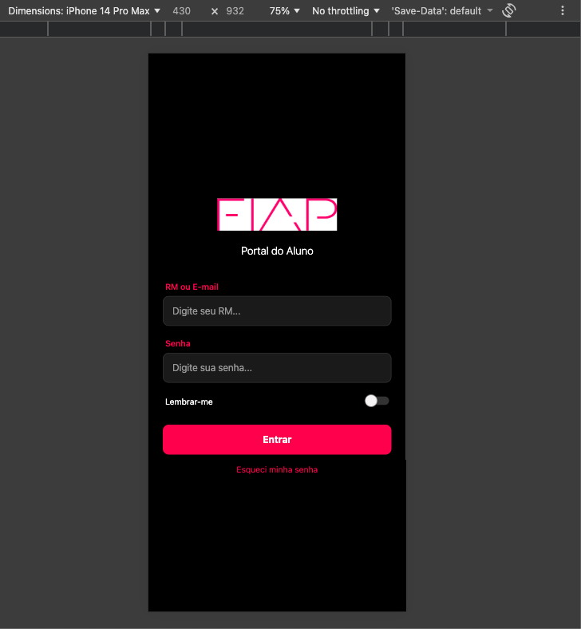

# CP01 - Mobile Development

## Sobre o Projeto
Este projeto é um aplicativo mobile educacional desenvolvido com React Native (utilizando o Expo) que simula o aplicativo oficial da FIAP. A aplicação é composta por uma nova tela de Login personalizada e uma listagem com os horários de aulas do aluno (matutino e noturno).

## Arquitetura

A arquitetura do aplicativo foi construída com foco em componentização e gerenciamento de estado simples (hooks):

- **Telas**: Navegação condicional baseada em estado para exibir a Página de Login (`LoginScreen`) ou a tela base (`MainContent`).
- **Componentes Customizados**: A aplicação encapsula os inputs através de um componente próprio (`CustomInput`) para reutilização do layout, além do componente visual para os blocos de aulas (`ScheduleItem`).
- **Mocks de Dados**: A lista de aulas é renderizada dinamicamente com base em arquivos locais mockados (`scheduleData.ts`).

## Bibliotecas e Frameworks Utilizados

- **React Native**: Criação da estrutura mobile.
- **Expo**: Ferramenta de build, execução e testes iterativos da aplicação mobile de forma rápida.
- **React Native Safe Area Context**: Gerenciador flexível da área segura do aplicativo para evitar "recortes" com barras de navegação ou câmeras de dispositivos.

## Requisitos

- **Software**:
  - Node.js instalado
  - Gerenciador de Pacotes (`npm` ou `yarn`)
  - Emulador (Android Emulator / iOS Simulator) ou Smartphone Físico (com **Expo Go**)
  - IDE de sua preferência

## Instruções de Uso

O aplicativo pode ser executado facilmente no ambiente de desenvolvimento local usando a suíte do Expo.

1. Navegue até o diretório do projeto: `cd cp-01-mobile`
2. Instale as dependências necessárias do projeto:
   ```bash
   npm install
   ```
3. Inicie o servidor do Metro Bundler:
   ```bash
   npm start
   ```
4. Para visualizar o projeto, você pode usar seu smartphone escaneando o QR Code exibido no terminal utilizando o aplicativo **Expo Go**, ou abrindo o projeto no simulador configurado.



## Integrantes 

- Arnaldo Filho - RM 555780
